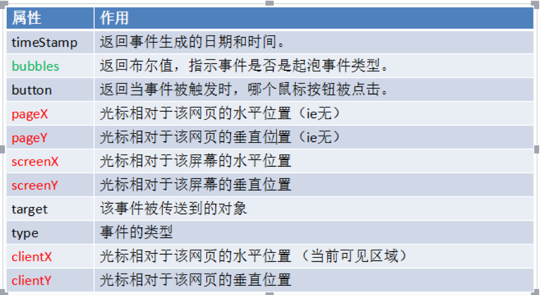

# 04-事件-1-事件简介

## 一 事件的使用

浏览器中的 JS 是以事件驱动为核心的一门语言，事件即是可以被 JavaScript 侦测到的行为，是一种触发-响应机制。

网页中的每个元素都可以通过行为触发相应的事件，如：点击按钮-->产生事件--->执行操作。

事件的三要素是：事件源、事件、事件处理程序，如下所示：

```js
let btn = document.querySelector('#btn')

// btn为事件源、click为事件，绑定的函数为事件处理程序
btn.onclick = function () {
  console.log('btn 被点击了')
}
```

事件的触发一般对应 on 前缀开头，常见事件有：

```txt
click       鼠标单击
dbclick     鼠标双击
mouseover   鼠标悬停
mouseout    鼠标移除
change      文本内容或下拉菜单中的选项发生改变
keyup       按下并释放键盘上的一个健
focus       获得焦点
blur        失去焦点
load        网页文档加载事件
unload      关闭网页时
submit      表单提交事件
reset       重置表单时

贴士：
mouseover/mouseout：会触发多次，每遇到一个子元素就会触发一次。
mouseenter/mouseleave：只会触发一次。
```

事件函数中的 this 代表调用者本身：

```js
btn.onclick = function () {
  // btn.disabled = true;
  this.disabled = true // 作用同上
}
```

## 二 事件绑定与取消

有两种事件绑定方式：

```js
// DOM0 级事件绑定方式：多次绑定会覆盖前一次事件执行函数
obj.onclick = function () {}
obj.onclick = function () {} // 再次绑定会覆盖前者

// DOM1 级事件绑定方式（监听）：多次绑定多不会覆盖前一次事件执行函数，多个函数会依次触发
obj.addEventListener('click', function () {}, false) // 绑定事件
obj.removeEventListener('click', function () {}, false) // 取消绑定
```

现在的主流浏览器都已经支持 DOM2 级事件，但是 IE8 不支持，而是实现了类似的两个方法：`attachEvent()/detachEvent()`

```js
// 只有两个参数：参数一为事件，带on；参数二为事件处理函数，但是该函数在全局作用域运行！！！，即其this为window
// 多次绑定会按照相反的顺序执行！！！
// 这2个事件只支持事件冒泡！！！
obj.attachEvent('onclick', function () {
  console.log(this === window) // true
})
```

下面的工具类可以做到兼容：

```js
let EventUtil = {
  addHandler: function (element, type, handler) {
    if (element.addEventListener) {
      element.addEventListener(type, handler, false)
      return
    }

    if (element.attachEvent) {
      element.attachEvent('on' + type, handler)
      return
    }

    element['on' + type] = handler
  },
  removeHandler: function (element, type, handler) {
    if (element.removeEventListener) {
      element.addEventListener(type, handler, false)
      return
    }

    if (element.detacheEvent) {
      element.detacheEvent('on' + type, handler)
      handler.call(element)
      return
    }

    element['on' + type] = null
  },
}
```

## 一 事件对象

当一个事件发生时，事件的详细信息（属性、方法）都会保存到一个对象中，这个事件对象即 event 对象。

```html
<div id="div"></div>
<script>
  let div = document.querySelector('#div')
  div.onclick = function (e) {
    console.log(e)
  }
</script>
```

只有在事件处理程序执行期间， event 对象才会存在；一旦事件处理程序执行完成， event 对象就会被销毁。

事件对象仍然有兼容问题，IE8 中，事件对象直接位于 window 中！兼容的写法如下：

```js
// 事件处理函数
function(e){
  e = e || window.event
}
```



## 二 事件调用者

在事件处理程序内部，this 其实是绑定事件的对象，即 `e.currentTarget`，而 `e.target` 则是触发事件的真实对象。

```html
<div id="div">
  <div id="div1"></div>
  <div id="div2"></div>
</div>
<script>
  let div = document.querySelector('#div1')
  div.onclick = function (e) {
    e = e || window.event
    // 本处示例点击div1
    console.log(e.target === document.querySelector('#div1')) // true
    console.log(e.currentTarget === this) // true
    console.log(e.target === this) // false
  }
</script>
```

## 三 阻止事件的默认行为

当一个事件发生时，浏览器会默认做一些事情，比如点击链接就会发生跳转，这些默认行为也是可以阻止的：

- 方式一：适用于 on 方式绑定的事件函数，在事件处理函数中使用 `return false`
- 方式二：如果事件是以 addEventListner 绑定，那么在事件处理函数中添加：`event.preventDefault();`

注意：只有事件的 cancelable 属性为 true，才能使用 `preventDefault()` 方法取消默认行为。

## 四 事件委托

在网页中，如果添加大量的事件处理程序，会影响页面的性能，事件委托能很好的解决该问题。

> 事件委托：只指定一个事件处理程序，就可以管理某一类型的所有事件，背后原理是事件冒泡

```html
<div id="div">
  <div id="div1">111</div>
  <div id="div2">222</div>
</div>
<script>
  // 如果要为div1，div2都添加相同的点击事件，显然是不合理的
  // 只需要在DOM的最高层级添加事件处理程序即可
  let div = document.querySelector('#div')
  div.onclick = function (e) {
    if (e.target.id == 'div1') {
      console.log('div1 click....')
      return
    }

    if (e.target.id == 'div2') {
      console.log('div2 click....')
      return
    }

    console.log('div click...')
  }
</script>
```

事件委托的好处即解决了性能问题：

- 函数即对象，大量函数会占用较高内存，事件委托可以明显减少函数数量
- 事件处理函数位于更高等级的 DOM 中，比如 document，可以很快访问到
