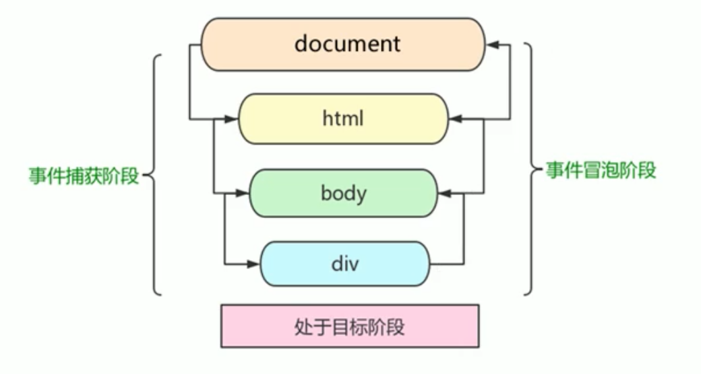

# 04-事件-3-事件流

## 一 事件流概念

事件流即页面在接收事件的顺序。事件发生时，会在元素节点之间按照一定的顺序进行向外、向内传播，该过程即为 DOM 事件流。

事件流有三个阶段：

- 第一阶段：捕获阶段(event capturing)
- 第二阶段：当前目标阶段
- 第三阶段：冒泡阶段(event bubbling)

如图所示：


注意：JS 代码中只能执行捕获或者冒泡中的一个阶段，而且 onclick 和 attachEvent 只能得到冒泡阶段。

贴士：事件冒泡本是 IE 中的事件流模型，但是现在已经被大多浏览器接受。

## 二 事件捕获与事件冒泡

### 2.1 事件捕获

如下示例中，给子元素添加了点击事件，第三个参数 true，即代表处于捕获阶段。当点击 son 元素后，document 开始捕获，但是 document 没有绑定点击事件函数，跳过依次进入 html 元素、body 元素、father 元素、son 元素，在 father、 son 元素处发现了点击事件函数，则执行：

```html
<div id="father" style="height: 200px; width: 200px; background-color: aqua">
  <div
    id="son"
    style="height: 100px; width: 100px; background-color: coral"
  ></div>
</div>
<script>
  let father = document.querySelector('#father')
  let son = document.querySelector('#son')
  father.addEventListener(
    'click',
    function () {
      console.log('father...')
    },
    true
  )
  son.addEventListener(
    'click',
    function () {
      console.log('son...')
    },
    true
  )
</script>
```

点击 son 元素区域，则输出：

```txt
father...
son...
```

### 2.2 事件冒泡

事件冒泡：多个元素嵌套，都注册了相同的事件，那么如果里面的元素触发了事件，则外面的元素都会自动触发该事件。即：当一个元素接收到事件的时候，会把接收到的所有事件传播给父级，一直到顶级 window。

事件捕获的案例中，如果事件处理函数第三个参数改为 false，则支持冒泡，输出结果为：

```txt
son...
father...
```

注意：一些事件是没有冒泡的，如：oblur、onfocus、onmouseenter、onmouseleave

## 三 阻止事件传播

### 1.1 阻止事件传播方式

stopPropagation()方法用于立即停止事件在 DOM 层次中的传播，即取消进一步的事件捕获或冒泡。例如，直接添加到一个按钮的事件处理程序可以调用 stopPropagation()，从而避免触发注册在 document.body 上面的事件处理程序：

```js
let btn = document.querySelector('#myBtn')

btn.onclick = function (event) {
  alert('Clicked')
  event.stopPropagation()
}

document.body.onclick = function (event) {
  alert('Body clicked')
}
```

IE8 仍然有兼容问题，其阻止冒泡的方式为：`event.cancelBubble = true;`。

### 1.2 阻止事件传播方式的兼容写法

在 IE 中，returnValue 属性设置为 false 可以用来阻止元素默认行为，cancelBubble 属性用来停止冒泡。

```js
let EventUtil = {
  // ... 省略之前的 addHandler  removeHandler代码

  getEvent: function (event) {
    return event ? event : window.event
  },

  getTarget: function (event) {
    return event.target || event.srcElement
  },

  preventDefault: function (event) {
    if (event.preventDefault) {
      event.preventDefault()
    } else {
      event.returnValue = false
    }
  },

  stopPropagation: function (event) {
    if (event.stopPropagation) {
      event.stopPropagation()
    } else {
      event.cancelBubble = true
    }
  },
}
```
