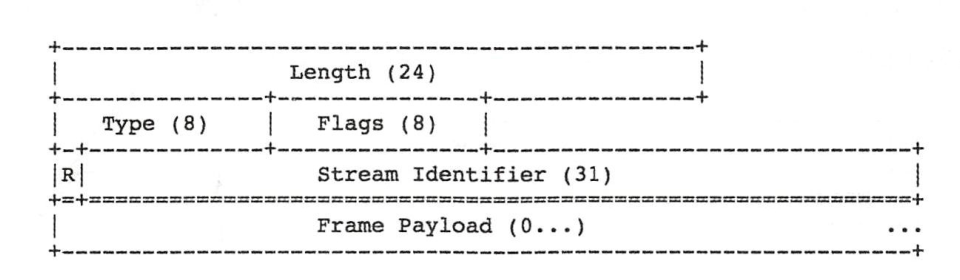
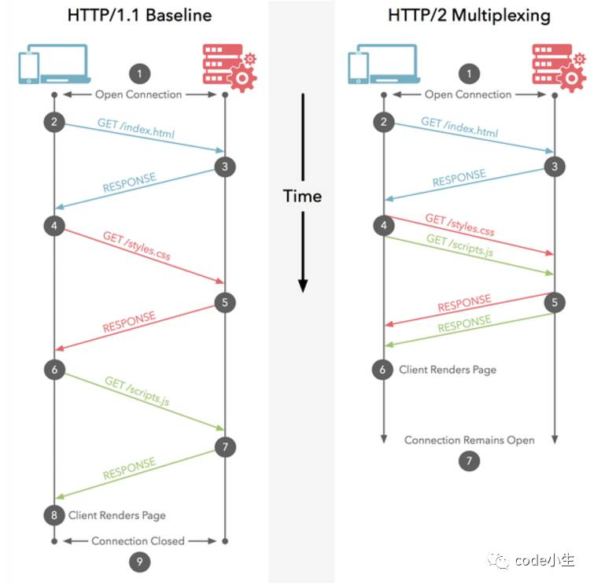

# 04-Http2

## 一 http1.1 逐渐被取代

HTTP 协议已经很古老，目前广泛使用的 HTTP 协议版本为 http1.1，该版本支持缓存处理、长连接、请求流水线处理等，但是仍然不符合当前 4G、5G 的发展。

http2.0 在性能上有了大幅提升，特点如下：

- 二进制传输
- 支持多路复用
- header 压缩
- 支持服务端推送

## 二 详解 http2 几大优势

### 2.1 二进制传输

http1.1 是基于文本传输的，http2 则基于二进制格式传输，能有效压缩传输数据大小。

在 http2 中，基本的协议单位是帧。帧的内容包括：

```txt
Length              长度
Type                类型
Flags               标记
R                   保留字段
Steam Identifier    流标识符
Frame Payload       帧主题
```

帧的布局：


http2 发送的数据是由一个或者多个帧组合成的消息。

### 2.2 多路复用

在 http1.0 中，如果需要并发多个请求，则必须创建多个 TCP 连接，一般最高只有 6 个，这些连接无法被复用。

为了解决连接无法复用问题，HTTP/1.1 引入了 Pipeling 解决方案，但是在该方案中：若干个请求排队串行化单线程处理，后面的请求等待前面请求的返回才能获得执行机会（FIFO），一旦有某请求超时等，后续请求只能被阻塞，毫无办法，也就是人们常说的线头阻塞；

HTTP/2 则允许多个请求同时在一个连接上并行执行，某个请求任务耗时严重，也不会影响到其它连接的正常执行；



至此，在 HTTP/2 中，连接是共享的，每一个 request 都是用作连接共享机制的，一个 req 对应一个 id，接收方根据 id 归属到不同的服务端请求里。

同时 HTTP/2 中还可以设置每个流的优先级，高优先级的流会被服务端优先处理并返回给客户端。

### 2.3 首部压缩

http1.1 则每次请求都附带大量的 header 信息，在 HTTP/2 中，通讯双方各自缓存一份 header fields 表，避免 header 的重复传输，减小传输文件大小。

### 2.4 服务端推送

服务端推送即支持从服务端主动推送信息给客户端。
