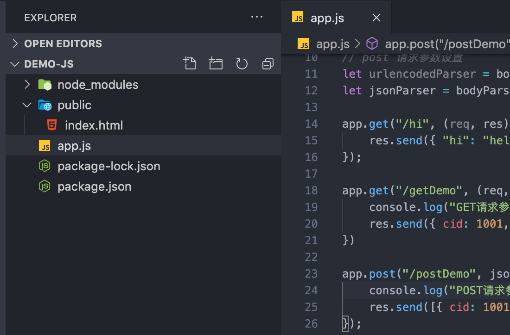

# 01-Ajax 基础使用

## 一 表单方式发送请求

在 Ajax 诞生之前，如果网速很慢，页面加载时间很长，就会导致用户一直在等待，而无法进行别的操作。在带表单的网页中，表单提交后，如果出现内容不合法，则会重新渲染页面，之前填写的内容就会消失。这些都是用户体验极差的现象，虽然可以通过一些手段避免，但是实现起来较为复杂。

## 二 Ajax 概述

Ajax 即 `Asynchronous Javascript And XML`（异步 JavaScript 和 XML），可以实现页面无刷新更新数据，极大提高了用户体验！

异步与同步：

- 异步：某段程序执行时不会阻塞其它程序执行，其表现形式为程序的执行顺序不依赖程序本身的书写顺序，相反则为同步
- 同步：必须等待前面的任务完成，才能执行后面的任务

Ajax 的本质仍然是 HTTP 协议上的网络通信，只不过是异步方式，其核心对象是：XMLHttpRequest（简称 XHR）。

## 三 准备服务器环境

Ajax 是客户端（浏览器）与服务端通信的方式，自然少不了服务端的参与。这里我们可以按照如下方式启动一个 Node 服务器。

首先需要下载并安装 NodeJS，进入网址<https://nodejs.org>，点击 LTS（长久支持）标识的安装包，下载后，一直下一步即可。

创建一个 NodeJS 项目，如下所示：



图中的 package-lock.json 本示例不需要，package.json 内容如下：

```json
{
  "name": "demo-ajax",
  "version": "1.0.0",
  "description": "",
  "main": "app.js",
  "scripts": {
    "dev": "node app.js"
  },
  "dependencies": {
    "body-parser": "^1.19.0",
    "express": "^4.17.1"
  }
}
```

app.js 是 NodeJS 项目的核心文件（入口文件），代码如下：

```js
const express = require('express') // 引入web框架 express
const path = require('path') // 引入 路径处理模块 path
const bodyParser = require('body-parser') // post 请求解析模块
const formidable = require('formidable') // 解析 FormData 的模块

const app = express() // 创建web服务器

// 静态资源目录
app.use(express.static(path.join(__dirname, 'public')))

// post 请求参数设置
let urlencodedParser = bodyParser.urlencoded({ extended: false })
let jsonParser = bodyParser.json()

app.get('/hi', (req, res) => {
  res.send({ hi: 'hello get' })
})

app.post('/hi', (req, res) => {
  res.send({ hi: 'hello post' })
})

app.get('/getDemo', (req, res) => {
  console.log('GET请求参数:', req.query)
  res.send({ cid: 1001, title: '新闻一', content: '内容一一一...' })
})

app.post('/postDemo', jsonParser, (req, res) => {
  console.log('POST请求参数:', req.body)
  res.send([{ cid: 1001, title: '新闻二', content: '内容二一一...' }])
})

app.post('/formDataDemo', (req, res) => {
  const form = new formidable.IncomingForm()
  form.parse(req, (err, fileds, files) => {
    if (err) {
      res.send({ error: err })
      return
    }
    // fileds 保存了普通键值对，files保存了上传的文件
    console.log('FormData参数:', fileds)
    res.send([{ cid: 1001, title: '新闻三', content: '内容三一一...' }])
  })
})

app.post('/uploadDemo', () => {
  const form = new formidable.IncomingForm()
  form.uploadDir = path.joind(__dirname, 'uploads')
  form.parse(req, (err, fileds, files) => {
    if (err) {
      res.send({ error: err })
      return
    }
    res.send([{ cid: 1001, title: '新闻三', content: '内容三一一...' }])
  })
})

app.get('/crosDemo', (req, res) => {
  res.send("let user = {'uid':'1001'}")
})

app.get('/crosDemo2', (req, res) => {
  // 获取回调函数名称
  let callback = req.query.callback

  // 定义要返回的数据
  let data = JSON.stringify({ uid: '1001' })

  // 返回数据
  res.send(`${callback}(${data});`)
})

app.listen(3000, () => {
  console.log('服务器启动成功')
})
```

在学习 Ajax 时，只需要在 public 文件夹下的 `index.html` 内书写示例即可。

运行：

```txt
# 进入项目根目录

# 安装依赖
npm i

# 运行项目
npm run dev
```

## 四 Ajax 示例

贴士：这些示例都需要启动配置好的 NodeJS 服务器。

在 public 文件夹的 index.html 中书如下 ajax（仍然使用接口：`/hi`）：

```html
<button id="btn">点击执行Ajax</button>
<script>
  let btn = document.querySelector('#btn')
  btn.onclick = function () {
    // 1 创建 Ajax 对象。IE6 中对象为：ActiveXObject("Microsoft.XMLHTTP");
    let xhr = new XMLHttpRequest()
    // 2 设置请求方式、请求地址
    xhr.open('get', 'http://localhost:3000/hi')
    // 3 发送请求
    xhr.send()
    // 4.获取服务器端响应的数据：由于 xhr.send() 是异步的，所以后面只能用事件方式监听
    xhr.onload = function () {
      // 返回结果是字符串，需要反序列化为 JSON对象
      let data = JSON.parse(xhr.responseText)
      console.log('data: ', data)
    }
  }
</script>
```

点击按钮即可执行 Ajax。
