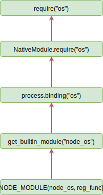

# 04-模块机制

## 一 模块简介

在项目开发中，对不同的项目功能需要做文件切割，以更好的产出可维护性代码，对分割后的不同功能代码的引入便需要编程需要编程语言的模块机制支持。

模块化的优势有：

- 防止命名冲突
- 代码复用
- 提升可维护性

JavaScript 由于诞生之初只是一个浏览器脚本语言，并未支持大型项目要求的模块化需求。

为了适应现在的发展，JavaScript 先后诞生了各种模块规范，如 AMD、CMD：

- CommonJS：主张文件即模块，通过 `module.exports` 导出接口，通过 `require()` 加载模块，被 Node.js 采用。
- AMD：一种异步加载模块的实现规范，提倡依赖前置，提前加载（函数运行前加载好依赖），Require.js 是其代表，目前已经逐渐淘汰。
- CMD：一种异步加载模块的实现规范，提倡依赖就近，按需加载（函数运行时才加载依赖），sea.js 是其代表，目前已经逐渐淘汰。
- ES Module：目前 ECMAScript 官方的方案

目前的主流模块化方案是：CommonJS、ES Module。但是 CommonJS 的文件加载是同步的，由于服务端的文件都位于服务器的本地磁盘中，所以 Node 采用该方式没有太大问题，但是该方式不适合前端中需要网络来加载远程模块！而 Node 现在也是 JavaScript 社区的一部分，也需要跟进 JavaScript 的更新，所以 ES Module 最后将会成为 JavaScript 最主要的模块化方案，没有之一。

## 二 CommonJS

### 2.1 CommonJS 规范

CommonJS 中定义一个模块：

```js
// 创建 math.js 文件
function add(num1, num2) {
  return num1 + num2
}

module.exports = add
```

在其他文件引入该模块：

```js
var add = require('./math')

console.log(add(5, 4)) // 输出 9
```

### 2.2 exports 的导出导入

exports 导出变量：

```js
// 新建 foo.js，导出 msg1 和 msg2 这两个变量
let msg1 = '你好'
let msg2 = 'hello world'
exports.zhText = msg1
exports.enText = msg2
```

变量导入并使用：

```js
// 新建一个 main.js，输入以下代码
let foo = require('./foo.js') // 核心模块（node 本身的模块）在导入时无须路径，如 let http = require('http');
console.log(foo.zhText)
console.log(foo.enText)
```

一个 JavaScript 文件，可以向外 exports 无数个变量、函数。但是 require 的时候，仅仅需要 require 这个 JS 文件一次。使用的它的变量、函数的时候，用点语法即可。所以，CommonJS 的模块导出、导入机制可以让用户完全不必考虑变量污染问题。

### 2.3 module.exports 与 exports. 变量 区别

**mdoule.exports** 直接导出了变量本身，而 **exports. 变量=** 则是将该导出的变量重新挂载到 `=` 后的变量上。

在本质上，`exports` 只是 `module` 对象下的一个属性。所有 `exports` 都是通过 `module.exports` 传递的，类似于每个模块头部都有：`var exports = module.exports;`。如图所示：


贴士：

- 多个 `module.exports`，只会导出最后一个，前面的都会被忽略
- `module.exports` 和 `exports` 不能共用
- require 并不依赖于 exports，可以加载一个没有暴露任何方法的模块，这相当于执行一个模块内部的代码

推荐在导出一个整体对象的时候使用 `module.exports`，因为 exports 是通过形参方式传入的，直接赋形参会改变形参的引用。

## 三 模块加载机制

### 3.1 文件类型查找机制

如果加载模块文件时，没有写后缀的话，找模块的时候会按照 `.js`，`.json`，`.node` 这三种后缀的优先级分别去找，查找过程如下：

- 首先按照加载的模块的文件名进行查找；
- 没找到，在模块文件名后加上 .js 后缀进行查找；
- 没找到，在文件名后加上 .json 后缀查找；
- 没找到，在文件名后加上 .node 后缀查找；
- 抛出错误。

贴士：在引入。node 和。json 文件时，带上标识名，会加快一点速度。

### 3.2 文件加载机制

在 Node 中，模块分为两大类：

- 核心模块：Node 官方默认提供的模块，如 fs、http，引入方式：`require('fs')`，无需指定路径。
- 文件模块：用户编写的模块，引入方式：`require('./mymodule/math')`，也可以使用绝对路径。
- 自定义模块：笔者认为可以称为第三方模块，也无需路径直接引入：`require('express')`

模块在被引入时大致要经过三个步骤：路径分析 --> 文件定位 --> 编译执行，但是在 Node 中，核心模块与文件模块加载时机制完全不同：

- 核心模块：这些模块在 Node 源码编译时候，已经编译进了 Node 的二进制可执行文件中，Node 程序启动时，这些模块就会被直接加载进内存。所以核心模块在引入时只有编译执行一步，其加载速度也是最快的！
- 文件模块：该部分模块在运行时动态加载，需要完整执行上述三步，速度较慢

当然还有一种情况，用户引入了第三方模块，这种模块位于 Node 默认提供的 `node_modules` 文件夹中，而这个文件夹在 Node 的项目目录、Node 安装目录中都存在着！！！由于 require 时没有指定路径，那么就需要 Node 进行逐级向上查找：

- 首先从当前项目目录下的 node_modules 中查找
- 从父目录下的 node_modules 中查找，依次类推
- 直到找到 Node 本身跟目录下的 node_modules 文件夹

该模块随着项目目录的深入，会造成大量耗时！！

### 3.3 文件缓存机制

已经加载的模块会被缓存，所以，**多次 require 同一个文件的时候不会重新加载**，只会加载一次；`require` 根据文件的路径去判断是否是同一个文件，路径一样的话，加载多次，用的也是第一次加载的内容。

所在 Node 在加载文件时的消耗上整体是：从缓存中加载 --> 加载核心模块 --> 加载文件模块。

注意：require 从缓存中加载文件是基于文件路径的，这表示即使有两个完全相同的文件，但她们位于不同的路径下，也会在缓存中维持两份。

查看缓存代码：

```js
console.log(require.cache)
```

当调用 require 加载一个模块时，模块内部的代码都会被调用！！！！，有时候这可能会带来隐藏的 bug。

module.js：

```js
function test() {
  setInterval(function () {
    console.log('test')
  }, 1000)
}
test()

module.exports = test
```

main.js:

```js
let test = require('./module')
```

main.js 只是加载了 module 文件，但是仍然每隔 1 秒输出了 test 字符串，且 main.js 的进程始终没有退出！！这在生产环境中极其造成内存泄漏。所以使用模块时要留意该情况。

### 3.4 文件目录分析机制

在查找 require 的文件时，没有找到相应文件，却找到了对应 require 参数的目录，此时 Node 会将目录当做一个包来处理，此时 Node 会查找到包内的哪个文件呢？

- 每个 Node 项目都带有 package.json 文件，该 json 文件内部有个 key 指定了包的入口文件 `"main":"app.js"`，此时 Node 会加载该包内的 app.js
- 如果 package.json 文件不存在，或者内部的 main 指定的文件名错误，则 Node 会依次查找包中：index.js、index.json、index.node
- 如果没找到，则抛出查找失败异常

### 3.5 重复引用问题

Node 无须关心重复引用问题，因为 Node 先从缓存中加载模块，一个模块被第一次加载后，就会在缓存中维持一个副本，如果遇到重复加载的模块会直接提取缓存中的副本，也就是说在任何情况下每个模块都只在缓存中有一个实例。

## 四 附源码查看方式

加入断点调试并不能进入源码，需要在 vscode 点击左侧的创建 launch.json 文件，然后注释掉：

```js
{
  // 使用 IntelliSense 了解相关属性。
  // 悬停以查看现有属性的描述。
  // 欲了解更多信息，请访问: https://go.microsoft.com/fwlink/?linkid=830387
  "version": "0.2.0",
  "configurations": [
    {
      "type": "node",
      "request": "launch",
      "name": "启动程序",
      // "skipFiles": [
      //   "<node_internals>/**"
      // ],
      "program": "${workspaceFolder}/index.js"
    }
  ]
}

```

此时就可以进入源码查看了。

## 一 包管理器 npm

### 1.1 包管理器的历史与作用

由于核心模块在 Node 程序启动时就已经从 Node 的安装目录中加载到了内存中，其引入方式只需要 `require("fs")` 即可。但是市面上仍然有大量的第三方包供我们使用，该如何引入呢？

Node 在这个地方做的非常出色，官方在开发者的推动下，推出了 <https://www.npmjs.com/> 包管理平台，无论 Node 的第三方包使用的是 github 还是 gitlab 还是其他源码工具管理，其包的下载都能在 npmjs 官网找到，并且能够使用 `npm` 脚本命令下载这些第三方包，这样的做法使得 Node 的开源生态非常丰富强大，避免了混乱。

Node 的安装包已经自动集成 `npm` 脚本命令，我们无需手动安装，在安装完 Node 后，可以使用如下命令查看 npm 版本：

```txt
npm -v
```

当然 npm 也存在极严重的缺陷，如 包安装地狱、版本锁定缺失等，这些问题困扰了 Node 开发者很多年，Facebook 推出了新的包管理工具 yarn，在一定程度上缓解了这些问题，后来 Node 官方也不甘示弱，新开发了 npm6 予以回击。

### 1.2 使用 npm 初始化一个 Node 项目

步骤一：初始化项目配置

```txt
mkdir demo      # 创建一个 demo项目文件件
cd demo
npm init        # 初始化Node项目环境，会在当前项目目录下生成核心配置文件  package.json，添加 -y 参数可以自动生成
```

步骤二：安装开发包

```txt
npm install express     # install会执行安装express开发包的命令，默认安装最新版本。 install可以简写为 i

# 安装完毕后，我们会在 package.json文件中发现该依赖，当前目录会生成文件夹 node_modules，express包便被安装在此目录中
```

步骤三：使用开发包

```js
// 安装了express包后，现在就可以使用express包了，新建一个文件 app.js，代码如下：
let express = require('express')

let app = express()

app.get('/', function (req, res) {
  return res.send('hello world')
})

app.listen(3000)
```

步骤三：测试。打开浏览器，访问 `http://localhost:3000/`，就会看到我们使用 express 包开发这个项目输出结果了。

### 1.3 npm 的一些使用

npm 在安装包时候可以设定其安装为生产环境还是开发环境，如下所示：

```txt
npm i express -g    # 全局安装
npm i express -S    # 以生产依赖形式本地安装，-S 是 --save 的缩写
npm i express -D    # 以开发依赖形式本地安装，-D 是 --save -dev 的缩写
```

### 1.4 npm 镜像与 cnpm

由于一些国内原因，npm 安装包速度很慢，可以设置 npm 镜像：

```txt
npm config rm proxy
npm config rm https-proxy
npm config set registry https://registry.npm.taobao.org
```

也可以直接使用淘宝开发的 cnpm 来代替 npm：

```txt
npm install cnpm -g
cnpm install jQuery
```

恢复 npm 镜像办法：

```txt
npm config set proxy=http://127.0.0.1:1080
npm config set registry=http://registry.npmjs.org
```

### 1.5 描述文件

在使用 `npm init`时会生成一个包描述文件 `package.json`，该描述文件详细解释了整个包的情况。

该文件内的一些字段非常重要：

```txt
main：      说明项目的入口文件是谁
scritps：   项目的脚本有哪些，如： "start":"node app.js"，这个脚本可以利用 npm 运行： npm run start
```

### 1.6 package-lock.json

npm5 之后为了锁定版本而设立的版本锁定文件，当项目存在该文件后，项目默认在 `npm i` 时，安装的版本为该文件内锁定的版本。

### 1.7 Node 项目正确的初始化方式

```txt
mkdir myproject
cd myproject
npm init          # 初始化项目，会生成 package.json，-y 参数可以直接按照默认项生成package.json
```

## 二 npx

Node 的包中，可执行程序位于 `./node_modules/.bin/` 目录中，如果我们安装完 npm 包，想使用该包的二进制执行程序，必须这样输入：

```txt
# 假设二进制可执行程序为 cmd
./node_modules/.bin/cmd
```

运行方式极为不便，npx5.2 之后添加了 npx 命令，用于快速启动 Node 的二进制可执行程序：

```txt
# 项目根目录中，无需输入路径
npx cmd
```

## 三 nrm

如果我们为 npm 包添加了很多镜像源，那么管理起来就很不便， nrm 包可以用来管理 npm 的镜像源。

```txt
# 安装 nrm
npm install -g nrm

# 列出当前镜像源
nrm ls
*npm ---- https://registry.npmjs.org/
cnpm --- http://r.cnpmjs.org/
taobao - http://registry.npm.taobao.org/

# 切换镜像源
nrm use taobao

# 增加镜像源
nrm add registry http://registry.npm.frp.trmap.cn/

# 删除镜像源
nrm del <registry>

# 测速
nrm test cnpm
```

## 四 npm 私有仓库

在企业中，为了安全性，npm 包都是自己部署的私有仓库，目前较好的私有仓库解决方案是：<https://github.com/verdaccio/verdaccio>

# 一 文件模块编译

### 1.1 编译过程简述

在 Node 中，每个文件模块都是一个对象，其定义如下：

```js
function Module(id, parent) {
  this.id = id
  this.exports = {}
  this.parents = parents
  if (parent && parent.children) {
    parent.children.push(this)
  }

  this.filename = null
  this.loaded = false
  this.children = []
}
```

文件在引入后，将会进行编译与执行，Node 在定位到具体文件后，会新建一个模块对象，根据路径载入并编译，对不同扩展名的文件，载入方法不同：

- .js 文件：通过 fs 模块同步读取文件后编译执行
- .node 文件：该模块是使用 C、C++编写的扩展文件，通过 `dlopen()`方法加载最后编译生成
- .json 文件：通过 fs 模块同步读取文件被当做 js 文件载入
- 其他扩展名文件：都被当做 js 文件载入，Node 推荐将其其他文件都编译为 JS 文件后再引入，这样可以减少 Node 不必要的编译过程

通过如下代码可以得到加载执行方式：

```js
console.log(require.extensions)

// 输出： { '.js': [Function], '.json': [Function], '.node': [Function] }
```

每一个编译成功的模块都会将其文件路径作为索引缓存在`Module._chache`对象上，以提高再次引入的性能。

### 1.2 JS 模块

在 Node 中，可以直接使用`__dirname`、`require`等默认 API，是因为在编译时，Node 会对 JS 文件内容进行头尾包装：

```js
// 在头部添加
;(function (exports, require, module, __filename, __dirname) {
  \n

  // 在尾部添加
  \n
})
```

如下所示，一个普通的 JS 文件被包装为：

```js
;(function (exports, require, module, __filename, __dirname) {
  var a = 3
  exports.add = function (num1, num2) {
    return num1 + num2
  }
})
```

通过上述包装，每个模块文件之间实现了作用域隔离，包装之后的代码通过 vm 原生模块的`runInThisContext()`方法执行，返回具体的函数对象。

### 1.3 C++模块编译

C++模块是指.node 扩展名的文件，这些文件都是已经经过 C++模块编译后生成的，所以无需编译，直接会被 `process.dlopen()`方法进行加载和执行，该方法由 libuv 提供（在 win 和 linux 实现不同）。

## 二 核心模块编译

Node 的核心模块都会被编译为二进制可执行文件，核心模块分为 C/C++编写、JavaScript 编写两种实现方式。C/C++实现的文件位于 Node 项目的 src 目录下，JavaScript 文件位于 lib 目录下。

Node 在进行编译 C/C++文件前，会先将所有 JavaScript 模块文件通过 v8 附带的 js2c.py 工具编译为 C/C++代码。此时所有内置的 JS 代码，如（src/node.js 和 lib/\*.js）会被转换为 C++里的数组，生成 node_natives.h 文件，JS 代码以字符串形式存储在一个叫做 node 的命名空间中，此时代码自然也是不可执行的。

使用 C/C++编写的内建模块有：buffer、crypto、evals、fs、os 等模块。这些内建模块都会通过 NODE_MODULE 宏将模块定义到 node 命名空间中，位于`node_module_list`数组中。如果要使用这些模块，Node 提供了`get_builtin_module()`方法可以从这个数组中取出这些模块。

内建模块不推荐使用文件模块直接调用，Node 在启东时，会生成一个全局变量 process，并提供 Binding()方法来协助加载内建模块。Binding()的实现位于`src/node.cc`中。


原生模块的引入流程：


