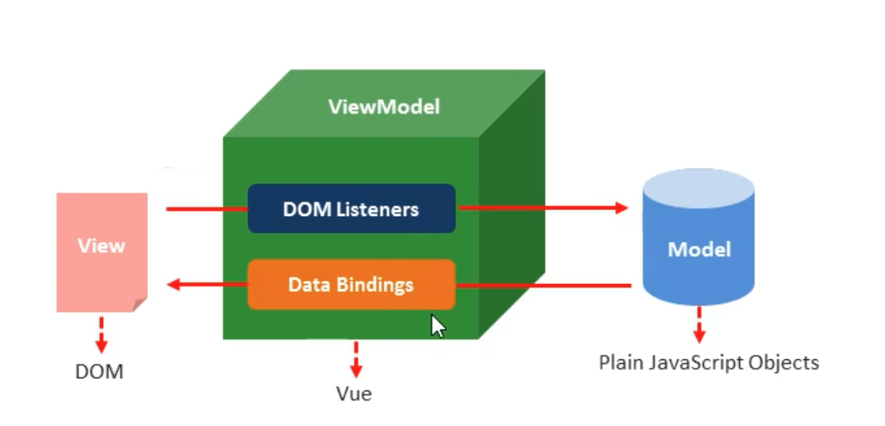

# 01.1-Vue 简介

## 一 开发思想 概念

### 1.1 MVC

在大型项目开发中，往往需要用业务逻辑、数据、界面显示分离的方法组织代码，以便在代码需要改进时能够做到最小化变更，便于扩展维护。

最经典的软件设计规范即 MVC（Model View Controller）：


- 模型 model：对业务数据的抽象，如用户数据包括：uid、name、age 等，在模型层，将其抽象为 User 对象，包含上述字段，并附带基础的增删改查实例操作
- 视图 view：数据的可视化界面。更加面向普通用户，提供给了用户操作界面，即前端开发中最常见的网页
- 控制器 controller：数据流向的控制者，在数据发生变化时更新视图。控制层位于视图层与模型层中间，负责视图层数据的流转，即根据用户在视图层提交的数据，去模型层执行增删改查等操作

### 1.2 MVVM

MVC 思想在传统后端领域实现较多，但是在前端，开发者更多关注的是界面与数据。前端在行为交互上存在大量的相同代码，比如 tab 切换需要反复对几个 tab 元素进行循环遍历从而实现数据到界面，界面到数据的双向交互，MVC 思想在前端领域适应性较低。

MVVM 是前端视图层的分层开发思想，将前端视图的结构划分为 M（model）、V（view）、VM（view-model）三层：

- M：数据模型层，这里是接口请求到的数据结果集，封装于 data 对象中，专门用来保存每个页面里单独的数据。
- V：视图层，vue 实例所控制的元素区域，即每个页面的 html 结构。
- VM：VM 调度者，即 new 出来的 vue 实例对象，用来解耦视图层与数据模型层。视图层想要获取或保存数据的都需要由 vm 做中间处理。

MVC 里的 C 是控制器，由不同的控制函数/对象，手动实现调度数据与视图转换。MVVM 的 VM 内部往往也存在一个虚拟 DOM，有了该调度者，开发者不再需要反复关注 DOM，只用与后台进行数据交互即可，数据模型的变更能够自动驱动视图的变更。

在前端中常见的具有 MVVM 思想的框架有：React、Vue。

在 MVVM 中：

- 模型层数据发生变动，通过数据绑定形式驱动界面发生改变；
- 界面上的数据发生改变时，通过对 DOM 的监听驱动模型层数据发生改变！

负责数据绑定、DOM 监听的就是 MVVM 编程的核心 VM 层，Vue/React 框架便是在其内部实现了这些机制。

## 二 Vue 框架

### 2.1 Vue 简介

Vue 是一个渐进式 MVVM 框架，只关注视图层（view），用来构建 Web 应用界面。所谓渐进式，即我们需要哪些功能就使用框架的哪些模块即可，vue 这样处理使其减少侵入性。

Vue 提供的主要功能：

- 声明式渲染：Vue 的核心库提供了数据渲染功能（vue 模板引擎），实现视图与数据解耦。
- 组件系统：对界面进行组件化
- 前端路由：可以用来制作移动端单页面应用
- 状态管理：对共享数据进行管理

Vue 与 原生 JS 对比：

- DOM 操作：原生 JS 如果要操作 UI，需要频繁操作 DOM，效率较低。（注意：jQuery 只是优化了 DOM 操作的代码写法而已，本质与原生 JS 一致）。React 框架内部实现了虚拟 DOM，在界面需要更新时，React 会在虚拟 DOM 中比较渲染前后的差异，决定最优更新哪些 DOM，由于虚拟 DOM 是内存数据，对实际 DOM 操作的仅仅是 Diff 部分，因而提高了性能。
- 组件化：原生 JS 组件化方案支持度不足，React 有完善的组件化支持（声明式）

贴士：在操作大量 DOM 时，js 的运行速度会被严重拖累。时常在更新数据后需要重新渲染页面，这样会造成一个困扰：数据未发生改变的地方也要被重新渲染一遍，资源严重浪费，虚拟 DOM 很好的解决了该问题。

贴士：虚拟 DOM 上绑定的属性极少，更加轻量（因为只有框架自己使用）

### 2.2 React 与 Vue 对比

React 与 Vue 共同点：

```txt
都具备MVVM思想
内部都采用虚拟DOM方式进行视图更新
具备组件化开发理念
```

他们在组件化开发方式上：React 采用 JSX 来编写组件，而 Vue 使用单文件组件方式开发组件。

### 2.3 Vue 的 MVVM 原理

Vue 的 MVVM 的原理图：


## 三 HelloWorld

### 3.1 HelloWorld 示例

```html
<div id="app">
  <div>{{msg}}</div>
  <!-- 获取数据 -->
  <button v-on:click="change">点击弹出数据</button>
  <!-- 绑定事件 -->
</div>

<!-- 当导入vue之后，在浏览器的内存中就多了一个vue构造函数 -->
<script src="https://cdn.jsdelivr.net/npm/vue/dist/vue.js"></script>
<script>
  // Vue实例
  new Vue({
    el: '#app', // 挂载元素
    // 数据源
    data: {
      msg: 'hello world',
    },
    methods: {
      change() {
        alert(this.msg)
      },
    },
  })
</script>
```

### 3.2 示例介绍

每一个应用都是通过 Vue 这个构造函数来创建根实例来启动的：

```js
    let app = new Vue({
        选项对象1,
        选项对象2,
        ...
    })
```

传入的选项对象包含：挂载元素、数据、模板、方法等，如下所示最常见的三个选项对象：

- el：挂载点，可以是元素，也可以是 CSS 选择器，支持原生 JS 写法
- data：代理数据
- methods：定义方法

Vue 代理 data 数据在 HTML 中使用插值 `{{}}` 进行渲染，除了绑定属性外，可以使用 js 表达式进行简单的运算，以及使用三元运算符，但不支持语句与流程控制。如果要真的输出 {{}} 此时可以使用 v-pre 指令：`<div v-pre>{{hi}}</div>`。

每个 Vue 实例都会代理其对应 data 对象中的所有属性：

```html
<div class="div">渲染数据为：{{a}}</div>

<script src="https://cdn.jsdelivr.net/npm/vue/dist/vue.js"></script>
<script>
  let result = {
    a: 1,
  }

  let app = new Vue({
    el: '.div',
    data: {
      a: 1,
    },
  })

  console.log('app.a = ', app.a) // 1
  console.log('app._data.a = ', app._data.a) // 1

  // 修改代理数据中的值，不会修改原始数据的值
  app.a = 2
  console.log('修改代理数据为2，原始数据值为：', result.a) // 1

  // 修改原始数据中的值，也不会再修改代理数据中的值
  result.a = 3
  console.log('修改原始数据为3，代理数据为：', app.a) // 2
</script>
```

贴士： `{{}}` 表示插值，可以将数据直接渲染在浏览器上。
