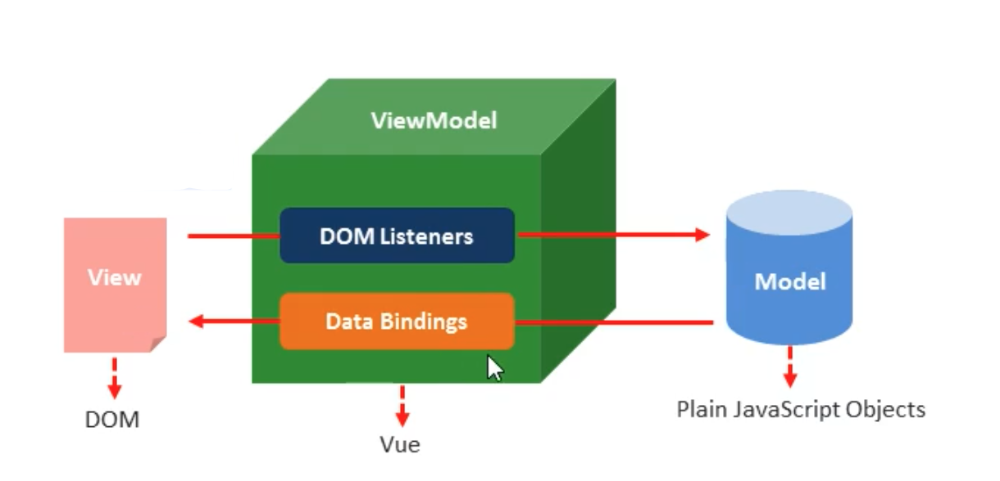

# markdown 语法
Markdown 是一种纯文本格式的标记语言，通过简单的标记语法，它可以使普通的文件呢内容具有一定的格式

##语法内容

### 一 、 标题
主要是通过"#"符号来设置表题"

```
 # 这是一级标题
 ## 这是二级标题
 ### 这是三级标题
 #### 这是四级标题
 ##### 这是五级标题
 ###### 这是六级标题
```
### 二 、 字体
- **加粗**
   
    需要在加粗文件的左右两边用两个*号包起来
    
- **斜体**
    
    要倾斜的文字左右分别用一个*号包起来：eg：*123*

- **斜体加粗**   
    
    要倾斜的文字左右分别用三个*号包起来：eg：***123***
    
- **删除线**   
    
    要倾斜的文字左右分别用三~~个号包起来：
    
    eg：~~123~~

### 三 、 引用 

在引用的文字前加>即可。引用也可以嵌套，如加两个>>三个>>>
n个...  
>这是目前最大的机构，朱迅在厉害的时候都没有机构走出来；
>>这是二级引用；
>>>这是三级引用；

### 四、分割线
三个或者三个以上的-或者*都可以

示例

- 1.---
- 2.----
- 3.****
- 4.***
***
分割中
**** 

### 五、图片
```

图片alt就是显示在图片下面的文字，相当于对图片内容的解释。
图片title是图片的标题，当鼠标移到图片上时显示的内容。title可加可不加

```

示例

```


```
网络图片加载法


本地图片加载法


### 六：超链接
```
 [超链接名称](超链接地址 "超链接title")
 title 可加可不加
```
示例
```
[简书](http://www.jianshu.com)
[百度](http://www.baidu.com)
```
[简书](http://www.jianshu.com "超链接title")

[百度](http://www.baidu.com)


### 六：列表
语法：无序列表用+*-任何一种都可以
```
- 列表内容
+ 列表内容
* 列表内容

注意：- + * 跟内容之间都要有一个空格

有序列表主要是加数字 空格与内容隔开
1. 列表内容
2. 列表内容
3. 列表内容
```
#### 6.1 列表嵌套
上一级与下一级之间敲三个空格即可；
- 一级无需内容
   - 二级无需内容
   - 二级无需内容
   - 二级无序内容
- 一级无需内容
   - 二级无需内容
   - 二级无需内容
   - 二级无序内容
1. 一级无需内容
   1. 二级无需内容
   2. 二级无需内容
   3. 二级无序内容
2. 一级无需内容
   1. 二级无需内容
   2. 二级无需内容
   3. 二级无序内容
      1. 三级有序
###七：表格
语法
``` 
表头|表头|表头
---|:--:|---:
内容123|内容456|内容789
内容123|内容456|内容789
第二行是分割表头和内容
- 有一个就行，有时为了对齐 ，多加几个
文字默认是居左的
- 两边都加： 表示文字居中
- 只加右边： 表示文字居右
```
示例：
``` 
姓名|技能|排行
--|:--:|--:
刘备|哭|大哥
关羽|打|二哥
张飞|骂|三弟
```
|ame | 价格 |  数量 |  
|-|-|-|
|香蕉 | $1 | 5 |
|苹果 | $1 | 6 |
|草莓 | $1 | 7 |


###八、流程图
```flow
st=>start: 开始
op=>operation: My Operation
cond=>condition: Yes or No?
e=>end
st->op->cond
cond(yes)->e
cond(no)->op
&
```


