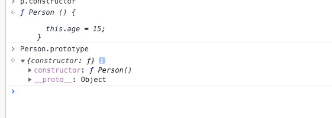
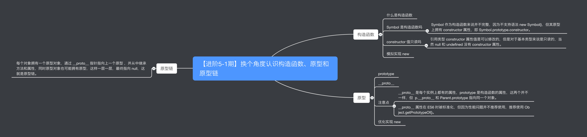
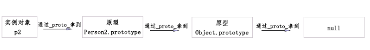

类型，涉及以下：
类型种类
判断
转换
深度拷贝
闭包，涉及以下：
作用域
v8 垃圾回收
变量提升
异步，涉及以下：
Promsie 的历史，用法，简单手写 Promsie 实现
async await 原理，generator
宏任务与微任务区别
原型链，涉及以下

CommonJS 和 ES6 module
AMD 与 CMD 区别（比较旧可以忽略）
ES6 特性
let const
箭头函数
Set、Map、WeakSet 和 WeakMap
之前提及的 Promsie，async，Class，Es6 module


    
# 04-原型链   
## 一 原型链概念 
###定义
在 js 中 几乎所有的对象都可以是原型对象(构造函数的.prototype)，也可以是实例对象( new xx() )，还可以是构造函数,当一个对象身兼多职,就可以被看作是一个节点，多个节点
组成一个链式结构，所以被称为原型链。

###js构造函数
    一般首字要大写，这是个约定俗称的事情，创建对象实例，要用new 操作符号，会先创建一个实例，然后在执行实例的代码；
###new 操作符号的过程；
    （1）创建了一个新的对象；
    （2）将构造函数的作用域赋给新对象；
     (3)执行构造函数中的代码（主要是为这个对象添加属性和方法）；
     (4)返回新对象
     
### 原型
    构造函数默认有prototype 原型对象，包含两个属性：constructor 和 __proto__；
    


#### prototype和 __proto__
    实例对象的__proto__ ===  构造函数的.prototype 相等；  
    prototype 是够造函数的一个默认属性，prototype 包含两个值__proto__(指向上一个够造函数.prototype)和curstortuct(用来生成一个对象的)


#### 继承
```js
function fistProto(name,age) {
   this.name = name;
   this.age  = age;
   this.number = 13;
}


function secondProto(name,age) {
   this.Se_name = name;
   this.Se_age  = age;
   this.Se_number = 13;
}


function thirdProto(name,age) {
   this.th_name = name;
   this.th_age  = age;
   this.th_number = 13;
}

fistProto.prototype.__proto__ = secondProto.prototype;
secondProto.prototype.__proto__ = thirdProto.prototype;


console.log(new fistProto())


```

#### 原型链继承原理：

```js
function new() {
   
   let obj = {}
   // 去掉构造海曙参数；
   let constructor = [].shift.call(arguments);// 获取arguments第一个参数；构造函数；
   // 把构造函数对象复制给实例对象的 __proto__;
   obj.__proto__ =  constructor.prototype;
   
   constructor.apply(obj,arguments)
  return obj ;
  
} 

/***
主要的步骤：
1.创建一个空对象；
2.获取获取arguments第一个参数；constructor
3.将空对象的__prpto__ 赋值为 构造函数的 prototype属性；
4.使用执apply行构造函数逻辑，并将对象指向obj；
5.返回obj 
*/
```


 
    
    继承
    oop 编程思想
    模块化
    
    
    
    



>首先通过new操作符，实例化构造函数，实例中含有_proto_属性（等于上一个构造函数Person2的prototype）
>>再通过Person2的_proto_指向上一层Object的prototype
>>>Object.proto 为null
```js
function Vue(options) {

  console.log( this )
    
  this._init(options);

}


function initMixin( Vue ) {
  Vue.prototype._init = function (options) {
    console.log(options)

  }
}


initMixin(Vue);


new Vue({"zhuxue":"我是你大爷"});
```


###
    
    
    


